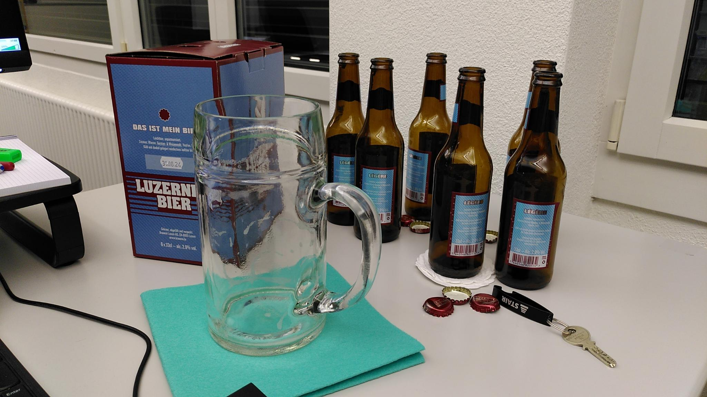

# Aufgabenstellung

Implementiere das Spiel _Vier Gewinnt_ für zwei menschliche Spieler als
Kommandozeilenanwendung in Rust. Die Spiellogik soll als Library umgesetzt und
mithilfe von Unittests geprüft werden. Der interaktive Teil kann manuell
getestet werden. Das Spiel soll auf einem Gitter von sieben (Breite) mal sechs
(Höhe) gespielt werden können. Der Spieler, der zuerst vier seiner Steine (`x`
und `o`) in eine ununterbrochene horizontale, vertikale oder diagonale Reihe
bringen kann, gewinnt das Spiel. Ist das Gitter komplett gefüllt, ohne dass
eine der Siegbedingungen eingetreten ist, wird das Spiel als Unentschieden
gewertet.

# Protokoll

26.06.2024

- Startzeit: 19:25
- Getränke:
    - 6 * Luzerner Bier Légère (1.98 Liter à 2.9%)
- Ereignisse und Erlebnisse:
    - ~20:00 Uhr: Erleuchtung wegen "rückläufigen Ranges": Der Compiler kann dies nicht prüfen! (Loop wurde nicht betreten)
        - man soll die Methode `rev()` von `Range` verwenden
    - ~20:08 Uhr: erste Pinkelpause (leichter Schwindel beim Aufstehen)
    - 20:14 Uhr: erstes Rülpsen
    - 20:35 Uhr: ranges mit exklusiven Obergrenzen werden beim Pattern Matching nur experimentell unterstütz
        - Die Compilermeldung wird mit Erstaunen und Entsetzen aufgenommen. Wut und Trauer machen sich breit.
    - 20:47 Uhr: Das DDD beeinträchtigt die Disziplin beim TDD.
    - ~20:50 Uhr: zweite Pinkelpause
    - 20:54 Uhr: Nachschenken
    - 20:57: zweites Rülpsen
    - 21:19: drittes Rülpsen
    - 21:30: Pinkelpause
    - 21:49: Unit Tests works, Integration Test fails
    - 21:51: alles funktioniert soweit

# Review

27.06.2024 (der Morgen danach)

Eine kritische und _nüchterne_ Betrachtung des Dargebotenen führt folgendes ans
Licht:

1. Der Fehler bei der Siegauswertung, dessen Analyse und Behebung ca. eine
halbe Stunde in Anspruch genommen hat, hätte schneller und einfacher behoben
werden können:
    - Die API hätte von Anfang konsequent mit 0-basierenden Indizes arbeiten
      sollen, also von 0 bis 6 statt von 1 bis 7. Zwar hätte man an einer
      Stelle auf Pattern Matching zugunsten einer `if`-Abfrage verzichten
      müssen, ansonsten wäre der Code aber klarer geworden. Bei der Anzeige
      hätte man weiterhin von 1 bis 7 durchnummerieren können. Die Umrechnung
      wäre aber in der Verantwortlichkeit des Client-Codes gewesen.
    - Das Inkrement/Dekrement der Schleifenvariablen `i` und `j` hätte wohl
      besser einmalig nach der Zuweisung von `r` und `c` erfolgen sollen, und
      dann nicht zu Beginn sondern am Ende beim Schleifendurchlauf. Der Code
      wäre dadurch klarer geworden.
    - Hätte ich die Ausgaben des Compilers und die Fehlermeldungen (panics)
      genauer angeschaut, wäre ich dem Fehler früher auf die Spur gekommen.
      Meine schlechte Angewohnheit wurde durch den Alkohol noch verstärkt.
2. Macht man Vim im Hintergrund aktiv, um Commits durchzuführen, muss man
   darauf achten, keine Swap-Files ins Repository aufzunehmen. Auch hier hätte
   ich die Ausgabe von `git status` genauer anschauen sollen, denn bei einem
   späteren Commit wurden diese Dateien gelöscht. (Ich hatte wohl vergessen,
   den Commit zu pushen.)
3. Sogar unter Windows kann man mit einem reinen aber mächtigen Texteditor wie
   Vim dank Cargo gut Rust programmieren.
4. Das Unentschieden hätte recht einfach geprüft und implementiert werden
   können, indem man die Felder mit dem Wert `EMPTY` zählt. Das Testen wäre
   aber etwas mühsam geworden und hätte dem Zuschauer auch kaum einen Mehrwert
   geboten.
