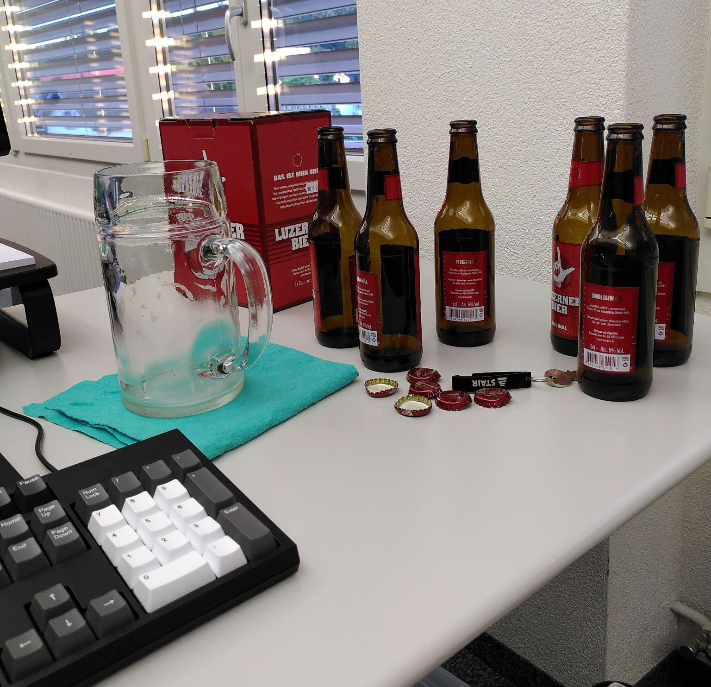

# Aufgabenstellung

Implementiere das Spiel _Reversi_ für zwei menschliche Spieler als
Kommandozeilenanwendung in Rust. Die Spiellogik soll als Library umgesetzt und
mithilfe von Unittests geprüft werden. Der interaktive Teil kann manuell
getestet werden. Das Spiel soll auf einem Gitter von acht (Breite) mal acht
(Höhe) gespielt werden können. Die Spielregeln können auf
[Wikipedia](https://de.wikipedia.org/wiki/Othello_(Spiel)) nachgelesen werden.

# Protokoll

11.07.2024

- Startzeit: ca. 18:04 Uhr
- Getränke:
    - 6 * Luzerner Bier Original (1.98 l)
- Ereignisse und Erlebnisse:
    - 18:19 Uhr: Schluckauf
    - 19:45 Uhr: Toilettengang
    - 19:51 Uhr: Feststellung erster Schwindelgefühle
    - 19:57 Uhr: erste Maß geleert
    - 20:00 Uhr: nachgeschenkt
    - 20:30 Uhr: erste spielbare Version fertig
    - 20:46 Uhr: Feststellung der offenen Punkte und starker Harndrang
    - 20:49 Uhr: Feedback des Bieres in Form eines Rülpsers

# Review

12.07.2024 (der Morgen danach)

Erneut soll die gestrige Leistung _nüchtern_ und kritisch betrachtet werden.
Dabei sollen auch beim Experiment gemachte Erkenntnisse festgehalten werden:

1. Arbeitet man mit Indizes (`usize`) und relativen Verschiebungen dazu
   (`isize`), kommt man nicht um explizite Typkonvertierungen herum. Dies liegt
   daran, dass Indizes nur positive Zahlen inkl. 0 sein können, während
   relative Verschiebungen positiv oder negativ sein können.
2. Das Pattern Matching auf eine bereits initialisierte Variable funktioniert
   nicht so wie ursprünglich von mir gedacht. In diesem Fall muss man auf
   `if`/`else` ausweichen, was aber bei Rust auch wie ein Ausdruck verwendet
   werde kann.
3. Die Darstellung (mit den Feldwerten `.`, `X` und `O`) sollte besser komplett
   von der internen Repräsentation getrennt werden. Zur Testbarkeit wären
   numerische Feldwerte übersichtlicher als solche vom Typ `char`, was die
   Umsetzung eines Übersetzungsmechanismus in der Form der `from`-Methode nötig
   gemacht hat.
4. Das Programmieren ging auch unter dem Einfluss von einigen Bier noch recht
   gut, beim Testen des Spiels sind mir aber ein paar dumme Missgeschicke
   passiert, wodurch ich den Testlauf zweimal unnötigerweise abgebrochen habe.
   Der Alkohol wirkt offenbar sehr stark auf die Wahrnehmung, während das
   Wiedergeben von Code weniger darunter leidet.
5. Die Redundanz beim Validierungs- und Umdrehungscode wurde nicht nur in der
   Implementierung, sondern auch von der Clientseite her gut sichtbar. Diesen
   Code zu vereinheitlichen habe ich mir nicht mehr zugetraut. Es wäre wohl
   sinnvoll, die beiden Schritte zu einer Operation zusammenzufügen, wobei der
   Rückgabewert dieser Operation sogleich über Erfolg und Misserfolg (invalider
   Spielzug) informieren müsste.
6. Nach dieser zweiten Session war ich weniger erschöpft als nach der ersten,
   obwohl die Aufgabenstellung schwieriger, das Bier stärker und die Session
   länger waren. Vielleicht hat sich hier ein gewisser Gewöhnungseffekt
   eingestellt. (Nach meinem ersten Unterrichtstag war ich damals im Sommer
   2021 heiser; mittlerweile haben sich meine Stimmbänder offenbar an die
   höhere Belastung im Schulzimmer gewöhnt.)
